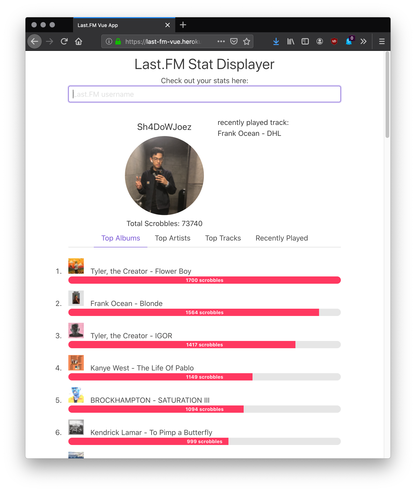

# Last.FM stat displayer

A simple Last.FM stat displayer, using Vue.js, Express.js. Buefy for UI.

Any Last.FM username entered will have its stats displayed. 

***For testing purposes, you can use mine:*** 
```
sh4dowjoez
```

Deployed to [Heroku](https://last-fm-vue.herokuapp.com) 

## Example: 




